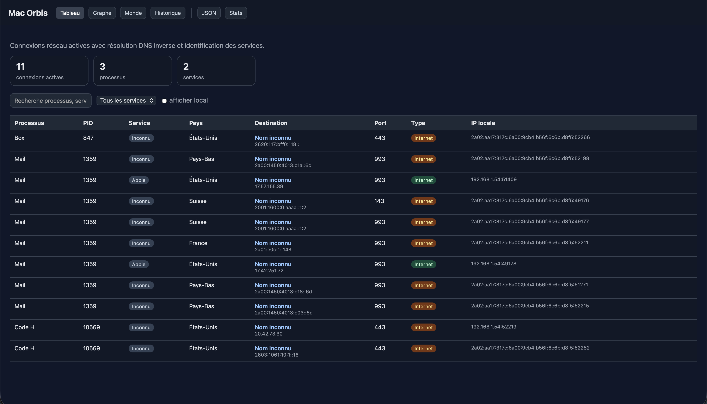
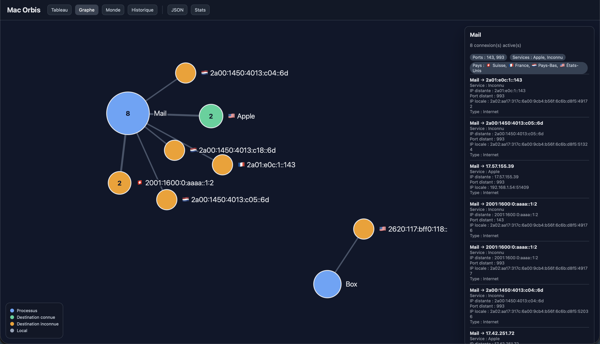
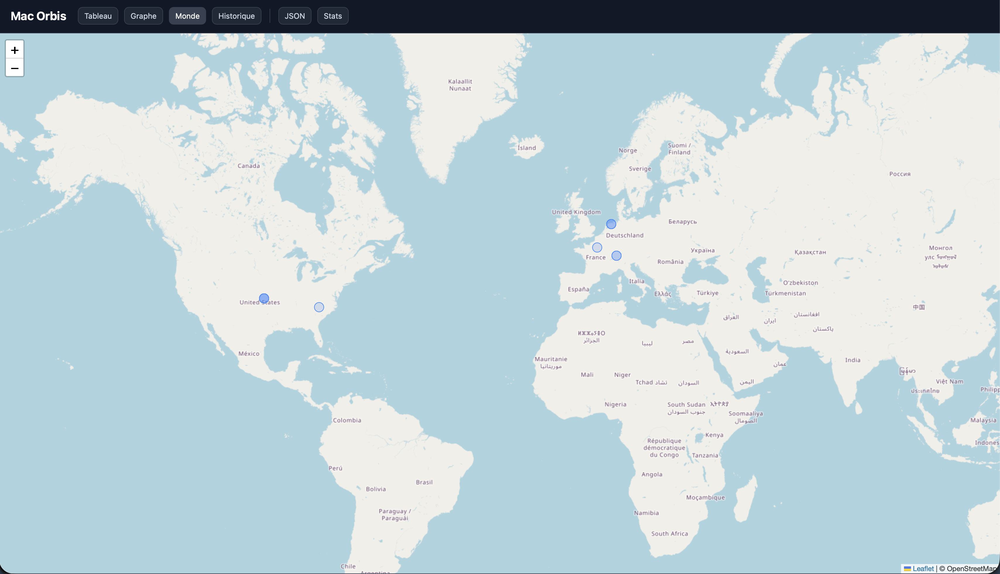

Mac Orbis est un outil de visualisation des connexions réseau pour macOS.

## Tableau de bord



## Graphe des connexions



## Carte du monde



Il permet d’identifier en temps réel :

- les processus actifs ;
- les connexions réseau sortantes ;
- les services utilisés ;
- les pays de destination ;
- les statistiques historiques ;
- les relations entre applications et destinations.

## Fonctionnalités

- Surveillance réseau en temps réel
- Identification des processus
- Résolution DNS inverse
- Géolocalisation IP
- Graphe des connexions
- Historique SQLite
- Tableau statistique

Visualisation graphique des relations :

``` Application
    │
    ├── Service
    │      └── Destination
```

Permet d’identifier rapidement les applications communiquant avec Internet.

## Carte du monde

Affichage géographique des connexions détectées grâce à la base GeoLite2 de MaxMind.

## Historique

Stockage local des connexions dans une base SQLite afin d’analyser l’activité réseau dans le temps.

## Statistiques
Agrégation des connexions par :

- processus ;
- service ;
- destination.

⸻

## Technologies utilisées
Backend :
- Python 3.9+
- FastAPI
- SQLite
- MaxMind GeoLite2

## Frontend :
- HTML5
- CSS3
- JavaScript
- D3.js
- Leaflet

⸻

## Installation

Cloner le dépôt

``` git clone https://github.com/septanteneuf/Mac-Orbis-for-Mac.git
cd Mac-Orbis-for-Mac
python3 -m venv .venv
source .venv/bin/activate
pip install -r requirements.txt
```

## Télécharger GeoLite2

- Inscription MaxMind : https://www.maxmind.com/en/geolite2/signup
- Dépôt GitHub MaxMind : https://github.com/maxmind

Puis placez le fichier ici :

```text
backend/data/GeoLite2-City.mmdb
```
⸻

## Lancement

```bash
python -m uvicorn backend.main:app --reload
```

## Interface disponible sur

```text
http://127.0.0.1:8000
```
⸻

## Limitations

Sous macOS, certaines informations réseau nécessitent des privilèges supplémentaires.
Le mode lsof est actuellement utilisé comme méthode de collecte stable.
Le support avancé de nettop est en cours de développement.

⸻

## Roadmap

- [ ] Support complet de nettop
- [ ] WebSocket temps réel
- [ ] Cartographie ASN
- [ ] Export CSV
- [ ] Export PDF
- [ ] Alertes réseau

⸻

## Licence

MIT License
